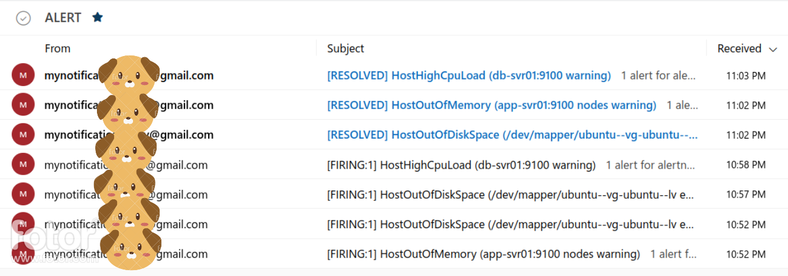

## 
 PROJECT_08 ( Monitoring and Alerting with Prometheus ) 

#### All instances are working well in Grafana Dashboard.

### Resources usages of instances are very high that shown in Grafana Dashboard.

### Email alert for High Memory usage of instances.

### Email alert for DiskSpaces Usages of instances.

### Email alert for High CPU usage of instances.

### Email alerts from Prometheus alert manager.

### Slack notifications alert from Prometheus alert manager.

##  For Demonstration of this Project with burmese language on Youtube. <a href="YOUTUBE_LINK">Click Here</a>

## 
  Thank you!!! 

